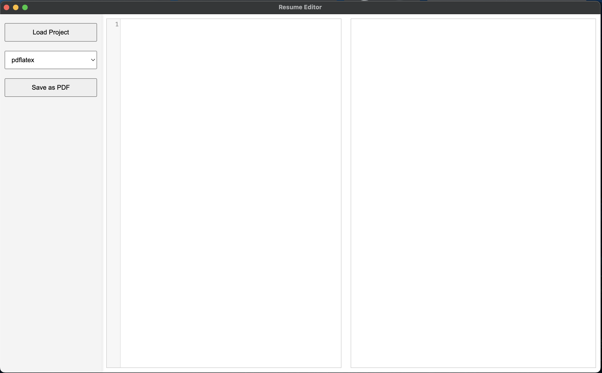
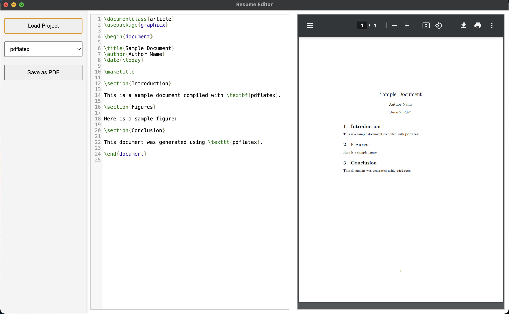
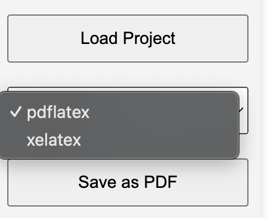

# ResumeSwap - LaTeX Resume Editing Application

ResumeSwap is an Electron-based application designed to edit LaTeX files for creating and managing resumes. The application features real-time PDF previews, LaTeX file editing, project loading, and PDF generation using XeLaTeX.

This is perfect for users who are lazy enough to edit their resumes manually each time for new job descriptions.

## Features

- **Edit LaTeX Files**: Write and edit LaTeX files directly within the application.
- **Real-time PDF Preview**: See a real-time preview of your LaTeX document as you edit.
- **Load Projects**: Load existing LaTeX projects for editing.
- **Save as PDF**: Generate and save PDF files from your LaTeX documents.
- **Supports Custom LaTeX Classes**: Use custom LaTeX classes such as `mcdowellcv`.

## Installation

1. **Clone the Repository**:

   ```sh
   git clone https://github.com/prashanth-up/resumeswap.git
   cd resumeswap
   ```

2. **Install Dependencies**:

   ```sh
   npm install
   ```

3. **Run the Application**:
   ```sh
   npm start
   ```

## Usage

1. **Loading a Project**:

   - Click on the "Load Project" button to open an existing LaTeX file.
   - The selected file will be loaded into the editor for editing.

2. **Editing LaTeX Content**:

   - Use the editor on the left side to write and edit your LaTeX content.
   - The editor supports syntax highlighting for LaTeX.

3. **Real-time Preview**:

   - The right side of the window displays a real-time PDF preview of your LaTeX document.
   - Any changes made in the editor are immediately reflected in the preview.

4. **Saving as PDF**:
   - Click the "Save as PDF" button to generate and save a PDF version of your LaTeX document.
   - You can select the desired LaTeX engine (e.g., XeLaTeX) for generating the PDF.

<p align="center">

</p>
<p align="center">

</p>
<p align="center">

</p>
<!-- 

 -->


## Requirements

- **Node.js**: Ensure you have Node.js installed. You can download it from [Node.js](https://nodejs.org/).
- **XeLaTeX**: Make sure XeLaTeX is installed on your system. This is required for generating PDFs, especially if using the `fontspec` package.

## File Structure

- **main.js**: Main process script responsible for creating the application window and handling IPC.
- **preload.js**: Preload script for exposing safe APIs to the renderer process.
- **renderer.js**: Renderer process script that manages the editor and preview functionality.
- **index.html**: Main HTML file containing the layout of the application.
- **styles.css**: CSS file for styling the application interface.

## Custom LaTeX Classes

If you are using custom LaTeX classes like `mcdowellcv`, ensure that the class file (`mcdowellcv.cls`) is accessible. Update the path in `preload.js` to point to the correct location of the class file.

## Future Work

- [ ] Add hot-swappable chunks to generate multiple resumes on the fly
- [ ] Add GPT API to make resume ATS friendly with specific keywords
- [ ] Add Cross platform compatibility
- [ ] Add multiple LaTex renderers support
- [ ] Add Testing and Debug functionalities
- [ ] Add email sign in for database support(Firestore)

## Contributing

Contributions are welcome! Please follow these steps to contribute:

1. Fork the repository.
2. Create a new branch (`git checkout -b feature-branch`).
3. Commit your changes (`git commit -am 'Add new feature'`).
4. Push to the branch (`git push origin feature-branch`).
5. Create a new Pull Request.

## License

This project is licensed under the MIT License. See the [LICENSE](LICENSE) file for details.

## Acknowledgements

- [Electron](https://www.electronjs.org/) for the cross-platform desktop application framework.
- [CodeMirror](https://codemirror.net/) for the in-browser code editor.
- [LaTeX](https://www.latex-project.org/) for the typesetting system.

## Contact

For any questions or suggestions, please don't contact [Prashanth Umapathy](mailto:PleaseDontAskMeAnything@nowhere.com).
